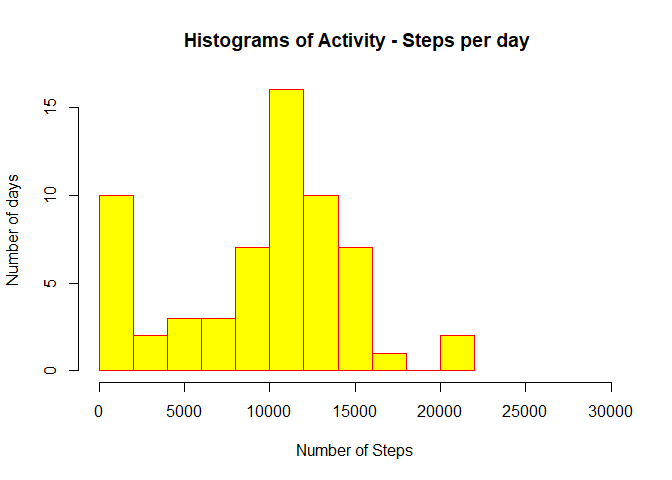
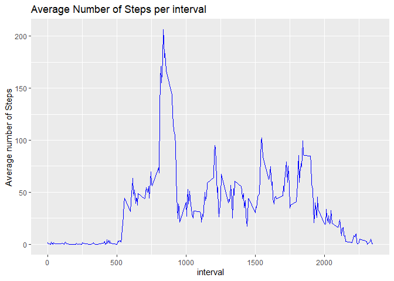
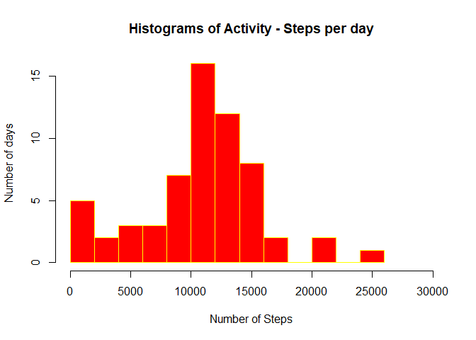
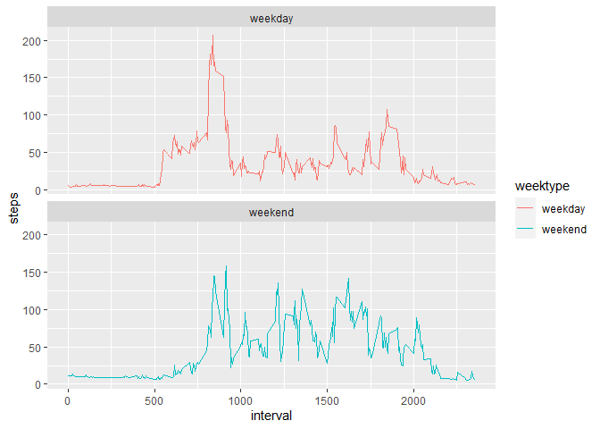

# Assignment Submitted for Week 2 Project

#### Set the working directory

```r
setwd("D:/2020/Education/Data Science/Course 5/week 2/RepData_PeerAssessment1/activity")
```

#### Include the library that would be used


```r
library(dplyr)
```

```
## 
## Attaching package: 'dplyr'
```

```
## The following objects are masked from 'package:stats':
## 
##     filter, lag
```

```
## The following objects are masked from 'package:base':
## 
##     intersect, setdiff, setequal, union
```

```r
library(ggplot2)
library(lubridate)
```

```
## 
## Attaching package: 'lubridate'
```

```
## The following objects are masked from 'package:base':
## 
##     date, intersect, setdiff, union
```

## Loading and preprocessing the data
#### Read the file into a variable activity

```r
activity<-read.csv("activity.csv")
```


#### Make the column date usable


```r
activity$date<-ymd(activity$date)
```

#### Add the week of the day as a column


```r
day<-weekdays(activity$date)
activity<-cbind(activity,day)
```

#### What is mean total number of steps taken per day?

```r
activityTotalSteps <- with(activity, aggregate(steps, by = list(date), sum, na.rm = TRUE))
names(activityTotalSteps) <- c("Date", "Steps")
```

### Create histogram 

```r
hist(activityTotalSteps$Steps, col="yellow", border="red", xlim=c(0,30000),breaks=10, main=" Histograms of Activity - Steps per day",xlab="Number of Steps", ylab="Number of days")
```

<!-- -->


#### Mean and Median of the steps per day

```r
mean(activityTotalSteps$Steps)
```

```
## [1] 9354.23
```

```r
median(activityTotalSteps$Steps)
```

```
## [1] 10395
```


#### Average daily activity pattern


```r
averageDailyActivity <- with(activity, aggregate(steps, by = list(interval), FUN=mean, na.rm = TRUE))
names(averageDailyActivity) <- c("interval", "Mean")
```

#### Plot the Graph for average daily activity pattern

```r
gr<-ggplot(averageDailyActivity,mapping=aes(interval,Mean))+
geom_line(col="blue")+
xlab("interval")+
ylab("Average number of Steps")+
ggtitle("Average Number of Steps per interval")
print(gr)
```

<!-- -->


#### The 5-minute interval that, on average, contains the maximum number of steps


```r
averageDailyActivity[which.max(averageDailyActivity[,2]),]$interval
```

```
## [1] 835
```


# Code to describe and show a strategy for imputing missing data

#### Calculate and report the total number of missing values in the dataset (i.e. the total number of rows with NAs

```r
sum(is.na(activity[,1]))
```

```
## [1] 2304
```
##### So we are fine to proceed

#####Devise a strategy for filling in all of the missing values in the dataset. The strategy does not need to be sophisticated. For example, you could use the mean/median for that day, or the mean for that 5-minute interval, etc.

#### Step1: create a dataframe identical as activity


```r
activity_f<-activity
```

#### Step 2: create a vector with null value for steps

```r
activity_nas<-is.na(activity_f$steps)
imputed<-data.frame(activity_f[is.na(activity_f[,1]),])
```
#### Step 3: merge the data containing averageDaily activity and imputed based on average steps for that interval


```r
update_imputed<-merge(imputed, averageDailyActivity,by="interval")
activity_f[activity_nas,]$steps<-update_imputed$Mean
```

#### Check for Null Value

```r
sum(is.na(activity_f$steps))
```

```
## [1] 0
```
All is well with the 0 null values in the answer

####Create variables for use in Histograms

```r
activity_fTotalSteps <- with(activity_f, aggregate(steps, by = list(date), sum, na.rm = TRUE))
names(activity_fTotalSteps) <- c("Date", "Steps")
```


#### Mean and Median of the steps per day

```r
mean(activity_fTotalSteps$Steps)
```

```
## [1] 10766.19
```

```r
median(activity_fTotalSteps$Steps)
```

```
## [1] 11015
```
#### Histogram of imputed activity

```r
hist(activity_fTotalSteps$Steps, col="red", border="yellow", xlim=c(0,30000),breaks=10, main="Histograms of Activity - Steps per day",xlab="Number of Steps", ylab="Number of days")
```

<!-- -->

# Are there differences in activity patterns between weekdays and weekends?
#### Create a new factor variable in the dataset with two levels – “weekday” and “weekend” indicating whether a given date is a weekday or weekend day.

```r
activity_f<-mutate(activity_f,weektype=ifelse(activity_f$day=="Saturday"|activity_f$day=="Sunday","weekend","weekday"))

interval_steps<-activity_f %>%
                group_by(interval,weektype) %>%
                summarise(steps=mean(steps))
```

```
## `summarise()` regrouping output by 'interval' (override with `.groups` argument)
```

```r
gr2<-ggplot(interval_steps, aes(x=interval,y=steps,color=weektype))+
      geom_line()+
      facet_wrap(~weektype,ncol=1,nrow=2)

print(gr2)
```

<!-- -->

From the two plots it seems that the test object is more active earlier in the day during weekdays compared to weekends, but more active throughout the weekends compared with weekdays (probably because the oject is working during the weekdays, hence moving less during the day).
